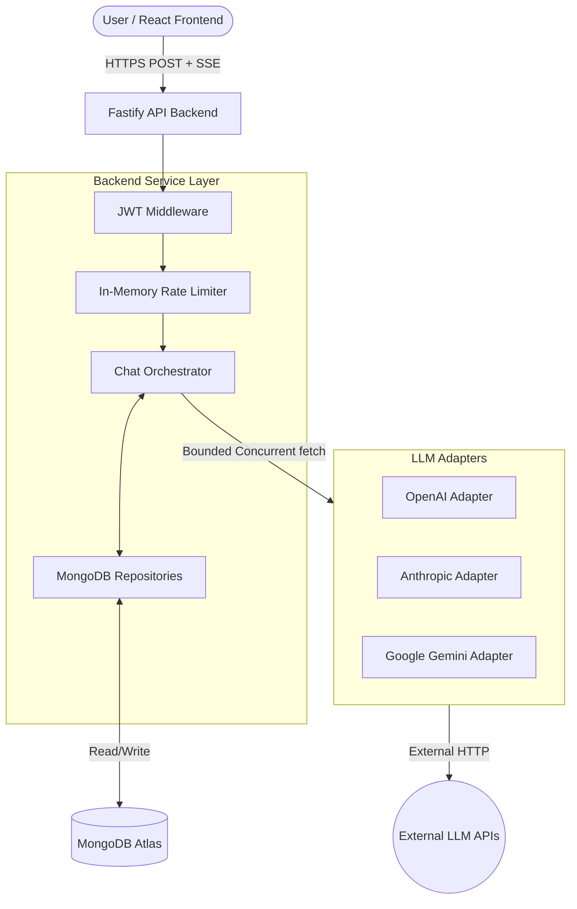
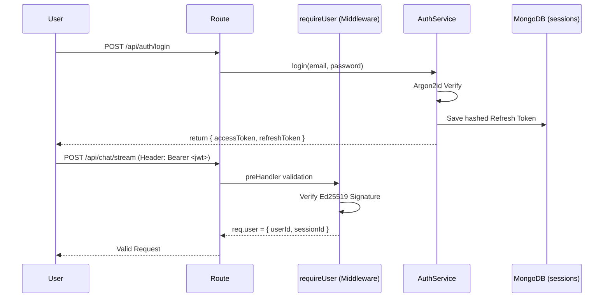
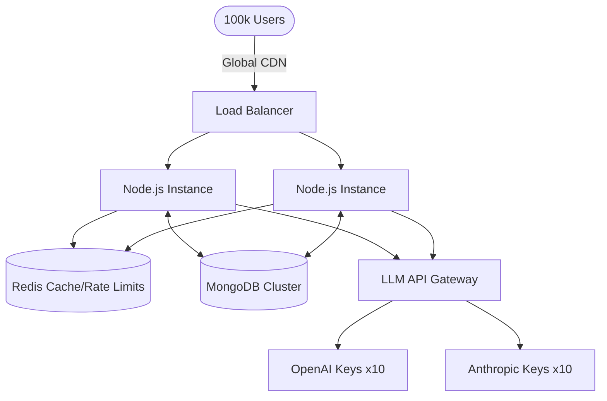
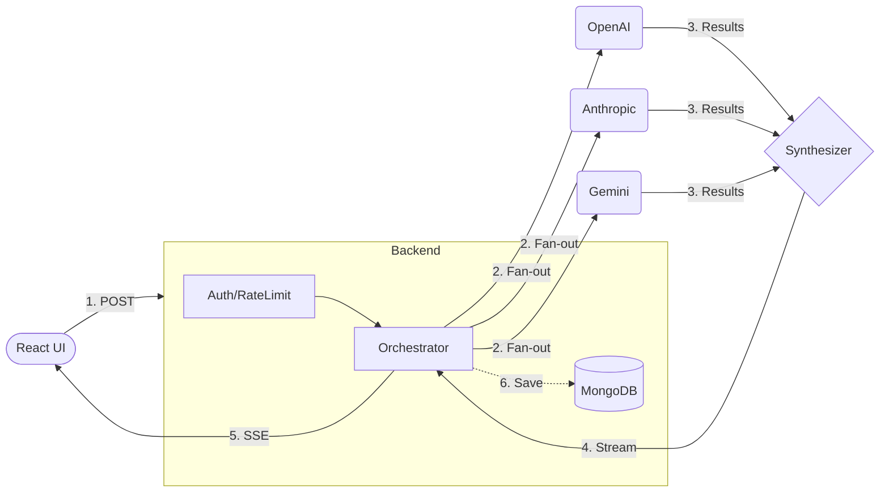

# NexusAI
## Complete Technical Interview Preparation Guide
Subtitle: Architecture • Backend • Multi-Model Orchestration • LLM Engineering • Streaming • Security • Database • Testing • DevOps • System Design

---

## 1. PROJECT OVERVIEW

### What is NexusAI?
NexusAI is a production-grade multi-model AI chat SaaS platform. It abstracts away the complexity of managing multiple underlying Large Language Model (LLM) providers (OpenAI, Anthropic, Google, etc.). Its distinguishing feature is **Synthesis**—instead of just querying one model, it queries multiple top-tier models concurrently and synthesizes their independent reasoning into a single, comprehensive, high-quality answer.

### Problem it solves
1. **Single Point of Failure:** If OpenAI goes down, most AI apps go down. NexusAI provides provider-level fault tolerance.
2. **Reasoning Diversity:** Different models have different strengths (e.g., Claude for coding, DeepSeek for math). Synthesis combines their strengths and resolves contradictions.

### "Explain NexusAI to a non-technical interviewer"
"NexusAI is an advanced chat application similar to ChatGPT, but instead of asking just one AI for an answer, it asks five different AI experts at the same time. It then takes all their answers, compares them, and gives you a single, finalized response that is much smarter and more reliable than what any one AI could do alone."

### 30-second answer (Interview-Ready)
"NexusAI is a multi-model AI platform I engineered using a Node.js/Fastify backend and a React frontend. The core architectural feature is bounded-concurrent orchestration. It fans out a single user prompt to multiple LLMs simultaneously, gracefully handles provider failures like timeouts or rate limits, and uses a synthesizer model to stream a consensus answer back to the client via Server-Sent Events."

### 1-minute answer (Technical Focus)
"NexusAI's orchestration layer abstracts away provider-specific SDKs using the Adapter pattern. When a user requests an answer, the backend fetches context from MongoDB and uses a bounded worker queue to concurrently stream requests to OpenAI, Anthropic, Mistral, and others. If a provider returns a 429 Rate Limit, the orchestrator catches and isolates the failure, allowing the surviving models to succeed. The successful outputs are injected into a synthesis prompt, and the final response is piped directly to the user over SSE. On the frontend, I used `requestAnimationFrame` to batch stream chunks and prevent React renders from locking the main thread."

### 2-minute answer (Architecture & Security)
"Beyond the multi-model streaming architecture, NexusAI is built with strict security and persistence in mind. Sessions are secured via Ed25519-signed JWTs, with opaque refresh tokens stored in MongoDB. Passwords are hashed using Argon2id, and I implemented dummy-hash validation to prevent timing attacks on email enumeration. The database schema denormalizes `userId` into the `messages` collection, eliminating IDOR vulnerabilities at the query level. For scaling, the backend is strictly stateless and relies on MongoDB TTL indexes for session expiry rather than requiring a dedicated Redis cluster, keeping the architecture lean but highly resilient."

---

## 2. TECHNOLOGY STACK

| Technology | Where used | Why used | Interview concepts |
| :--- | :--- | :--- | :--- |
| **Node.js + Fastify** | Backend API | Low overhead, extremely fast routing, and excellent async support for concurrent I/O. | Event loop, middleware, concurrency. |
| **TypeScript** | Full Stack | Type safety across boundaries (using shared `@nexusai/contracts`). | Type vs Interface, generics, runtime vs compile-time. |
| **React 19 + Vite** | Frontend | Modern, fast component rendering. | Hooks, state batching (`requestAnimationFrame`), optimistic UI. |
| **Zustand** | Frontend State | Lightweight global state without Redux boilerplate. | State management, flux pattern. |
| **Zod** | API Validation | Validates raw JSON payloads at runtime to guarantee type safety. | Runtime validation vs TS types. |
| **MongoDB (Atlas)** | Database | Flexible schema for chat histories, TTL indexes for session management. | NoSQL vs SQL, indexes, denormalization. |
| **jose (Ed25519)** | Auth (JWT) | Asymmetric signing of access tokens. Fast and highly secure. | JWT claims, symmetric vs asymmetric encryption. |
| **@node-rs/argon2** | Auth (Passwords) | Memory-hard hashing. Defends against GPU cracking. | Hashing vs encryption, salts, timing attacks. |
| **Server-Sent Events (SSE)** | Streaming | Unidirectional text streaming over HTTP without WebSocket overhead. | SSE vs WebSockets, chunked transfer encoding. |
| **Vitest** | Testing | Fast execution of 538+ unit and integration tests. | Mocking, integration testing with DB sandbox. |

*(Note: Redis is deliberately omitted as it is not a dependency in this deployment—see ADR-013).*

---

## 3. COMPLETE ARCHITECTURE

The architecture follows a strict separation of concerns, moving from edge presentation down to database persistence.

- **Frontend (Vercel):** A React/Vite SPA. Manages optimistic UI updates, parses incoming SSE streams, and batches renders.
- **Backend (Render):** A Fastify Node.js server containing:
  - **Routes & Middleware:** Authenticates JWTs, applies fixed-window rate limits, and parses Zod schemas.
  - **Application/Domain Layer:** The `ChatOrchestrator` handles the complex lifecycle of LLM fan-out, synthesis, and fallback.
  - **Infrastructure Layer:** Concrete implementations of `ProviderAdapter` (e.g., `AnthropicAdapter`) handle raw HTTP calls to external LLMs. Repositories (e.g., `MessageRepository`) handle MongoDB queries.
- **Database (MongoDB Atlas):** Persists `users`, `sessions`, `conversations`, and `messages`.

### Diagram: High-Level Architecture



---

## 4. COMPLETE REQUEST LIFECYCLE

*This is the most critical flow to understand for a backend or system design interview.*

1. **User Action:** The user types a prompt and hits "Send" in the React frontend.
2. **Optimistic UI:** The frontend immediately renders a "loading" message bubble.
3. **API Request (`frontend/src/features/chat/use-chat-stream.ts`):** The frontend issues an HTTP POST to `/api/chat/stream`. It uses the native `fetch` API, passing the JWT in headers.
4. **Authentication (`backend/src/api/middleware/authenticate.ts`):** Fastify's `preHandler` extracts the JWT, verifies the Ed25519 signature using `TokenService.verifyAccessToken`, and attaches `{ userId, sessionId }` to the request context.
5. **Rate Limiting (`backend/src/api/middleware/rate-limit.ts`):** The fixed-window `RateLimiter` checks if the user has exceeded their concurrent or per-minute chat limits. If so, it returns 429 immediately.
6. **Input Validation:** Zod validates the request body against `ChatRequest` to ensure the payload format is strictly correct.
7. **Context Lookup (`backend/src/domain/orchestration/orchestrator.ts`):** The `ChatOrchestrator` is invoked. It queries `MessageRepository` to load the previous messages in the conversation (building the context window).
8. **Provider Fan-out:** Based on the requested models (found in `catalog.ts`), the Orchestrator initiates a bounded-concurrent fan-out. It creates a worker queue to call `adapter.generate()` for each requested LLM.
9. **External API Calls (`backend/src/infrastructure/llm/adapters/`):** The specific adapter (e.g., `AnthropicAdapter`) maps the internal request to the provider's specific JSON wire format, attaches the secret API key, and calls `fetch()`.
10. **Result Collection & Error Classification:** 
    - If successful, the adapter returns the text and token counts.
    - If an error occurs (e.g., Anthropic returns 400 Bad Request due to a bad model ID), `classifyProviderError` maps it to a domain `AppError` (e.g., `INVALID_REQUEST` or `PROVIDER_UNAVAILABLE`).
11. **Synthesis (`backend/src/domain/synthesis/prompt.ts`):** The Orchestrator gathers all successfully generated texts. It builds a large system prompt containing these texts and sends it to the designated "writer" model (e.g., GPT-4o) using `adapter.stream()`.
12. **SSE Streaming (`backend/src/api/sse.ts`):** As the synthesizer yields chunks (via `readUpstreamSSE`), the `SseWriter` formats them as `data: {...}\n\n` and pipes them over the open HTTP connection back to the client.
13. **Frontend Parsing:** The frontend `fetch` promise resolves with a `ReadableStream`. A custom parser reads the chunks, enqueues them, and uses `requestAnimationFrame` to batch React state updates for buttery smooth rendering.
14. **Database Persistence (`backend/src/infrastructure/repositories/message-repository.ts`):** Once the stream concludes, the Orchestrator aggregates the final synthesized text, along with metadata (latency, outcome, token usage) for every individual model, and saves the user and assistant messages to MongoDB.

---

## 5. BACKEND ARCHITECTURE

NexusAI enforces a strict Domain-Driven, Layered Architecture.

- **`src/api/` (Presentation/Transport):** Contains Fastify routes, SSE streaming logic, and middleware. It knows about HTTP, headers, and status codes.
- **`src/application/` (Use Cases):** Coordinates domain and infrastructure (e.g., `AuthService`).
- **`src/domain/` (Core Logic):** Contains business rules, error definitions, model catalogs, and the `ChatOrchestrator`. It is completely ignorant of HTTP and databases.
- **`src/infrastructure/` (External Integrations):** Contains the MongoDB Repositories and external LLM Adapters.

### Why this design?
If everything were placed inside a Fastify route handler (`app.post('/chat', ...)`):
1. **Testing:** You could not test the complex orchestration logic without mocking HTTP requests and an entire Fastify server.
2. **Coupling:** Changing the database from MongoDB to PostgreSQL would require rewriting the HTTP handling and LLM logic.
3. **Resilience:** By separating `ProviderAdapter` into infrastructure, the `ChatOrchestrator` can handle failures generically without caring if the underlying error came from OpenAI or Anthropic.

---

## 6. MULTI-MODEL ORCHESTRATION

### The Architecture
1. **`catalog.ts`**: The source of truth for available models. Defines `id: 'claude-sonnet'`, `provider: 'anthropic'`, and the exact upstream `providerModelId` (e.g., `claude-3-5-sonnet-latest`).
2. **`registry.ts`**: Instantiates adapters based on available environment variables.
3. **`orchestrator.ts`**: Executes the models, handles timeouts, isolates failures, and coordinates synthesis.

### Interview Question
**"Suppose I ask you to add a completely new LLM provider tomorrow, like Cohere. What files/code would you change?"**
**Answer:** "Because of the abstraction, I wouldn't need to touch the core orchestration logic. I would:
1. Create a `CohereAdapter` in `src/infrastructure/llm/adapters/` that implements the `ProviderAdapter` interface (`generate()` and `stream()`).
2. Add the Cohere models to the `CATALOG` array in `catalog.ts`.
3. Add the `COHERE_API_KEY` to the environment config and instantiate the adapter in `registry.ts`. The orchestrator will automatically pick it up and can now fan-out to it alongside OpenAI and Anthropic."

---

## 7. PROVIDER ABSTRACTION

The code uses the **Adapter Pattern** combined with the **Strategy Pattern**.

- **Pattern:** Adapter Pattern.
- **Location:** `backend/src/infrastructure/llm/adapters/anthropic.ts`.
- **Problem Solved:** Anthropic requires `system` prompts as a separate top-level field and streams `content_block_delta` events. OpenAI puts `system` inside the `messages` array and streams `[DONE]`. 
- **Why Useful:** The `ProviderAdapter` forces all APIs into a single standard: `generate(request)` returns `GenerationResult`, and `stream(request)` yields an `AsyncIterable<string>`. The `ChatOrchestrator` just loops over adapters without knowing their specific quirks.


---

## 8. CONCURRENCY (NOT Naive Promise.all)

### Implementation
NexusAI does **NOT** use a naive `Promise.all(models.map(...))`. An unbounded fan-out over a user-controlled list is a serious vulnerability—it multiplies the server's outgoing connections and exhausts API rate limits instantly.

Instead, `orchestrator.ts` uses **Bounded Concurrency**:
```typescript
const queue = [...selectedModels];
const workers = Math.min(queue.length, MAX_CONCURRENT_PER_USER);
const pending = [];

for (let i = 0; i < workers; i += 1) {
  pending.push((async () => {
    for (;;) {
      const model = queue.shift();
      if (!model) return;
      await runOne(model);
    }
  })());
}
const fanout = Promise.all(pending);
```
**Why this matters:** This creates exactly `N` workers that drain a shared queue. It safely parallelizes requests while strictly capping the maximum simultaneous outbound connections per user.

### Latency Comparison
- **Sequential:** GPT-4o (3s) + Claude (4s) + Gemini (2s) = **9 seconds** total.
- **Bounded Concurrent:** All start simultaneously. The orchestrator waits for `Promise.all` to settle. Total time = **~4 seconds** (the slowest model plus overhead).

---

## 9. FAILURE HANDLING

Because NexusAI depends on external networks and highly variable LLM APIs, failure is a first-class citizen.

### The Flow
1. **Provider Adapter** catches an HTTP error (e.g., HTTP 429).
2. It passes the status and body to `classifyProviderError()`.
3. The function returns a strongly typed domain error (e.g., `Errors.providerUnavailable()` or `Errors.contextTooLong()`).
4. The **Orchestrator** catches this `AppError`. Instead of aborting the entire request, it sets the model's outcome in the database to the error code (e.g., `PROVIDER_UNAVAILABLE`).
5. The **Frontend** receives this metadata and renders an inline error for that specific model on the Provenance rail, while still displaying the overall synthesized answer.

### Common Error Classifications (`backend/src/infrastructure/llm/errors.ts`)
- **HTTP 429 (Rate Limit):** Mapped to `PROVIDER_UNAVAILABLE`.
- **HTTP 429 (Quota Exhaustion):** OpenAI returns 429 for both standard rate limits and hard billing quota exhaustion. NexusAI detects `"exceeded your current quota"` and maps it to `AUTH_ERROR` to take the provider out of rotation.
- **HTTP 400 (Bad Model ID):** Mapped to `INVALID_REQUEST`. (We specifically fixed a bug where Anthropic was fed an invalid model ID).
- **HTTP 413 / 400 (Token Overflow):** Mapped to `CONTEXT_TOO_LONG`.

---

## 10. RATE LIMITING

There are two completely different concepts of rate limiting in NexusAI:

### A. User → NexusAI (Inbound)
Implemented in `backend/src/api/middleware/rate-limit.ts`.
- **Current Implementation:** Fixed-window in-memory map per Node instance.
- **Why no Redis?** ADR-013 states Redis is deliberately excluded from this deployment to simplify infrastructure. Therefore, limits are per-instance. Behind a load balancer, the effective limit multiplies by instance count.

### B. NexusAI → LLM Providers (Outbound)
- **Implementation:** NexusAI does **NOT** implement exponential backoff/retries for LLM requests.
- **Why?** Retrying a 15-second LLM request holds the user's HTTP connection open unacceptably long. Instead, NexusAI relies on its core feature: **Isolation**. If Anthropic returns 429, NexusAI fails the Anthropic branch immediately and relies on OpenAI and Gemini succeeding concurrently to synthesize an answer.

---

## 11. SSE / STREAMING

### What is SSE?
Server-Sent Events (SSE) allows the Fastify backend to push text chunks to the React client over a standard, long-lived HTTP connection.

### The Backend Implementation
`readUpstreamSSE` (`backend/src/infrastructure/llm/sse-parse.ts`) uses a `TextDecoder` to read the raw `ReadableStream<Uint8Array>` from the provider. Because TCP packets can split chunks anywhere, it buffers text until it finds a double newline (`\n\n`), then yields complete `data:` payloads.

### SSE vs WebSockets
| Feature | SSE | WebSockets |
| :--- | :--- | :--- |
| **Direction** | Unidirectional (Server -> Client) | Bidirectional |
| **Protocol** | Standard HTTP | Upgraded TCP protocol |
| **Complexity** | Low (Native `fetch` API) | High (Requires WS server) |
| **NexusAI Use Case** | Perfect (LLMs only stream *out* text) | Overkill |

---

## 12. FRONTEND ARCHITECTURE & RENDERING OPTIMIZATION

**Stack:** React 19, TypeScript, Vite, Tailwind 4, Zustand.

### The Problem: React Freezing
LLMs stream text extremely fast (often 100+ tokens per second).
If the frontend calls `setState((prev) => prev + token)` 100 times per second, React attempts to reconcile the virtual DOM 100 times per second. This locks the browser's main thread, making the chat unscrollable and freezing CSS animations.

### The Solution: `requestAnimationFrame` Batching
In `frontend/src/features/chat/use-chat-stream.ts`:
1. Incoming text deltas are synchronously pushed into a mutable `useRef` queue.
2. A single `requestAnimationFrame` is scheduled.
3. When the browser is ready to paint (~60 times a second), the `flush()` function fires, empties the entire queue, and commits a single `setState` with the aggregated text.
4. **Result:** React renders a maximum of 60 times a second, completely decoupling UI performance from network token speed.


---

## 13. AUTHENTICATION

NexusAI enforces authentication via Ed25519-signed JWTs, ensuring a completely stateless (yet highly secure) access verification path.

### Flow Diagram


### Components
1. **Access Token:** Short-lived (e.g., 15m). Signed using the Ed25519 private key. Verified mathematically without touching the database.
2. **Refresh Token:** Long-lived (e.g., 30d). It is an opaque 32-byte string. Crucially, the server only stores the **SHA-256 hash** of the refresh token in MongoDB.
3. **Revocation:** Because the session document is stored in MongoDB, logging out simply deletes the session document. The user can no longer obtain new Access Tokens.

---

## 14. PASSWORD SECURITY & ARGON2ID

NexusAI uses `@node-rs/argon2` to hash passwords.
- **Why Argon2id?** It is the winner of the Password Hashing Competition and is recommended by OWASP. It is memory-hard, making it extremely expensive for an attacker to crack passwords using GPU clusters.
- **Timing Attack Mitigation:** Attackers can enumerate users by measuring response times. If `email@doesntexist.com` returns in 5ms, but `real@user.com` returns in 60ms (due to hashing), they know the email exists. NexusAI implements a `verifyAgainstDummy()` fallback: if the user isn't found, the backend *still hashes a dummy string* to ensure all login attempts take ~60ms.

---

## 15. JWT / ED25519

**What is it?** Ed25519 is an asymmetric elliptic curve signature scheme.
**Why use it over HMAC/HS256?**
With symmetric HS256, any microservice that needs to verify the token also needs the secret key—meaning it can forge tokens. With asymmetric Ed25519, NexusAI uses the **Private Key** to sign the token, and any service can use the **Public Key** to verify it. If a read-only service is compromised, the attacker cannot forge new JWTs.

---

## 16. AUTHORIZATION + IDOR

**Authentication:** Are you who you say you are? (JWT Verification).
**Authorization:** Are you allowed to access this resource? (Ownership Verification).

### Preventing IDOR (Insecure Direct Object Reference)
If a user makes a `GET /api/conversations/:id` request, a vulnerable backend might just query `db.collection('conversations').findOne({ _id: req.params.id })`.
NexusAI prevents this at the lowest infrastructure level. The `ConversationRepository` requires the authenticated `userId` for every fetch:
```typescript
db.collection('conversations').findOne({ 
  _id: new ObjectId(id), 
  userId: new ObjectId(userId) 
});
```
This guarantees that an attacker cannot access another user's conversation, as the database engine itself enforces the intersection.

---

## 17. MONGODB ARCHITECTURE

### Collections
1. `users`: Stores emails and Argon2id password hashes.
2. `sessions`: Stores hashed refresh tokens and `expiresAt` dates.
3. `conversations`: Groups chat messages together.
4. `messages`: Stores individual user and assistant messages, including the provenance metadata (which model generated what).

### Critical Indexes
1. **TTL Index on Sessions:** 
   `{ key: { expiresAt: 1 }, expireAfterSeconds: 0 }`
   *Why it exists:* MongoDB automatically deletes the session document precisely when the `expiresAt` timestamp is reached. This eliminates the need for cron jobs or Redis key expirations.
2. **Compound Index on Messages:** 
   `{ key: { conversationId: 1, createdAt: -1, _id: -1 } }`
   *Why it exists:* When the UI loads a chat, it requests the most recent messages for a conversation. This index perfectly satisfies the equality match (`conversationId`) and the sort (`createdAt: -1`), preventing MongoDB from having to load all documents into memory to sort them.


---

## 18. API DESIGN

| Method | Endpoint | Auth | Purpose | Request Body | Response |
| :--- | :--- | :--- | :--- | :--- | :--- |
| `POST` | `/api/auth/register` | No | Creates a new user | `{ email, password }` | `{ accessToken, refreshToken }` |
| `POST` | `/api/auth/login` | No | Authenticates user | `{ email, password }` | `{ accessToken, refreshToken }` |
| `GET` | `/api/models` | Yes | Gets active models | N/A | `[{ id, provider... }]` |
| `POST` | `/api/chat/stream` | Yes | Generates LLM response | `{ prompt, models... }` | HTTP SSE (`text/event-stream`) |

---

## 19. ZOD / VALIDATION

**TypeScript vs Zod:** TypeScript types (`interface ChatRequest`) are erased at compile time. At runtime, an attacker can pass `prompt: 123` or a 50MB string.
NexusAI uses **Zod** to validate incoming JSON dynamically. If `ChatRequest.parse(request.body)` fails, it throws an error that Fastify catches, automatically returning a `400 Bad Request` with detailed validation paths. This prevents malicious payloads from ever reaching the domain logic.

---

## 20. PROVENANCE

**What is it?** Transparency into which model generated which text.
**Implementation:** NexusAI's Orchestrator records the `ModelOutcome` for every model that was queried. This includes:
- `latencyMs` (Time taken)
- `inputTokens` / `outputTokens`
- `errorCode` (If failed)
- The raw `text` returned by that model.

This data is saved to MongoDB. The frontend reads it to visualize an "Orchestration Rail", letting the user see exactly which models agreed, disagreed, or failed due to rate limits.

---

## 21. TESTING

**Current Test Count:** 538 Automated Tests (Vitest).

| Scenario | Test Type | What is Verified |
| :--- | :--- | :--- |
| **Invalid JWT** | Integration | `requireUser` rejects requests with tampered JWT signatures. |
| **Orchestrator Failure** | Unit | If Anthropic throws 429, the Orchestrator safely continues with OpenAI. |
| **IDOR Access** | Integration | A test logs in as User A and attempts to fetch User B's conversation. Asserts a 404 is returned. |
| **Live Providers** | Live e2e | Calls the actual OpenAI/Anthropic APIs to ensure adapter parsing is historically and currently accurate. |
| **SSE Formatting** | Unit | `readUpstreamSSE` correctly buffers fragmented chunked TCP packets. |

---

## 22. DEVOPS / DEPLOYMENT

**Deployment Status:** Verified via `vercel.json` and repository architecture.
- **Frontend (Vercel):** Serverless global edge network. Proxies API requests to bypass CORS issues (`/api` rewrites to the Render URL).
- **Backend (Render):** Deployed as a persistent Node.js web service. Fastify binds to `0.0.0.0:PORT`.
- **Database (MongoDB Atlas):** Fully managed NoSQL cluster.

---

## 23. OBSERVABILITY

**Current Implementation:**
NexusAI uses **Pino** for extremely fast, non-blocking, structured JSON logging. Rather than using `console.log('Error')`, Pino outputs `{"level": 50, "msg": "Provider failed", "err": {...}}`. This allows platforms like Datadog to ingest, parse, and alert on errors programmatically.
**Future Scale:**
If traffic scaled heavily, we would inject a `requestId` into every log to trace a single request's lifecycle across multiple potential microservices.

---

## 24. PERFORMANCE (CURRENT VS FUTURE)

**Current Mechanisms:**
1. **Bounded Concurrency:** Limits active outbound LLM sockets per user, preventing Node.js event loop stalls.
2. **`requestAnimationFrame`:** Decouples React render frequency from SSE token arrival speed.
3. **Compound DB Indexes:** Prevents blocking, in-memory MongoDB sorts.

**At Scale (Future Improvements):**
If NexusAI scaled to 100k users, the in-memory fixed-window rate limiter would fail to synchronize across multiple Node instances. We would need to introduce **Redis** for distributed rate limiting. We would also need an intelligent API router (like LiteLLM) to load-balance LLM requests across multiple API keys to avoid hard provider quotas.


---

## 25. SECURITY AUDIT

| Component | Status | Details |
| :--- | :--- | :--- |
| **Passwords** | Implemented | Argon2id + dummy timing attack mitigation. |
| **JWT** | Implemented | Ed25519 asymmetric signatures. Short TTL. |
| **Refresh Tokens** | Implemented | Opaque 32-byte strings, stored as SHA-256 hashes in MongoDB. |
| **IDOR** | Implemented | Query-level `userId` injection on all protected resources. |
| **Input Validation** | Implemented | Zod runtime schema validation. |
| **Secrets** | Implemented | Passed strictly via `.env`; excluded from git. |
| **Rate Limiting** | Implemented | Fixed-window in-memory limits. |
| **Prompt Injection** | **Needs Review** | (Limitation) LLMs are inherently susceptible to jailbreaks. NexusAI does not currently employ a pre-filter LLM firewall. |

---

## 26. AI / LLM FUNDAMENTALS

- **Transformer / LLM:** The architecture powering GPT/Claude. It predicts the next most likely token.
- **Token:** A fragment of a word (roughly 4 characters in English). Models bill based on input/output tokens.
- **Context Window:** The maximum number of tokens the model can "remember" in a single request (e.g., Gemini has up to 2M).
- **Temperature:** A parameter between 0.0 and 2.0. Higher = more random/creative. Lower = more deterministic/focused.
- **System Prompt:** Instructions given to the model that the user cannot directly see (used heavily by the NexusAI Synthesizer to instruct it on how to merge answers).
- **Hallucination:** When an LLM confidently generates false information. (NexusAI mitigates this via multi-model synthesis).

---

## 27. RAG (Retrieval-Augmented Generation)

***INTERVIEW CONCEPT — NOT CURRENTLY IMPLEMENTED IN NEXUSAI***

**What is it?** LLMs only know what they were trained on. RAG gives them external knowledge.
1. **Chunking & Embedding:** You take a large document, split it into chunks, and convert the text into mathematical vectors (embeddings).
2. **Vector DB:** Store these vectors in a database (like Pinecone or pgvector).
3. **Retrieval:** When a user asks a question, convert their question to a vector. Use **Cosine Similarity** (or BM25 / Hybrid Search) to find the most relevant document chunks.
4. **Generation:** Inject the retrieved chunks into the LLM's System Prompt: *"Answer the user based ONLY on the following context..."*.

*How NexusAI would implement it:* We would add a Retrieval phase before the Orchestrator, fetching vector context and passing it to all concurrent LLMs to ensure they all operate on the same grounded facts.

---

## 28. DESIGN PATTERNS IN NEXUSAI

1. **Adapter Pattern:** `AnthropicAdapter` translates generic `GenerationRequest` objects into Anthropic's specific JSON structure.
2. **Strategy Pattern:** The Orchestrator decides at runtime which adapter to use based on the `catalog.ts` selection.
3. **Repository Pattern:** `MessageRepository` encapsulates raw `db.collection()` calls, exposing clean methods like `saveMessage()` to the domain logic.
4. **Dependency Injection:** Fastify injects `ChatOrchestrator` and `RateLimiter` into the route handlers, making the routes easily testable with mocks.

---

## 29. SCALING TO 100K USERS

**"If NexusAI grows to 100,000 users, how would you scale it?"**

### The Proposed Architecture
1. **Stateless Compute:** Because JWTs are stateless and sessions are in Mongo, we can auto-scale Fastify on Kubernetes or AWS ECS across multiple regions.
2. **Redis for Rate Limiting:** Replace the in-memory `RateLimiter` map with a Redis cluster using a leaky bucket algorithm to synchronize limits globally.
3. **Connection Pooling:** Increase MongoDB connection pools and potentially use read-replicas for fetching conversation history.
4. **Provider Quotas (The hardest problem):** At 100k users, we will exceed Anthropic's API rate limits. We would need to implement round-robin routing across dozens of API keys, or use a gateway like LiteLLM/Cloudflare AI Gateway.
5. **Streaming Offload:** Heavy SSE connections could exhaust Node.js socket limits. We could terminate SSE at an edge network (like Cloudflare or AWS API Gateway) to keep the Node processes handling pure compute.



---

## 30. TRADE-OFFS

### Fastify vs Express
*Technical Rationale:* Fastify uses a much faster underlying router (radix tree) and has significantly lower overhead than Express, which is critical when handling thousands of long-lived SSE connections concurrently.

### Bounded Concurrency vs Sequential Execution
*Technical Rationale:* Concurrency minimizes latency (fastest response possible) but multiplies API costs and risks immediate rate-limiting. Bounded concurrency (workers) strikes the perfect balance by parallelizing up to `MAX_CONCURRENT` while queuing the rest.

### Argon2id vs Bcrypt
*Technical Rationale:* Bcrypt is computationally expensive, but modern GPUs can compute it rapidly. Argon2id is memory-hard (requires RAM), rendering GPU-cracking highly inefficient.


---

## 31. PROJECT LIMITATIONS (HONEST DEFENSE)

**1. No Vector DB / RAG**
- *Why:* NexusAI focuses on orchestration and synthesis, not knowledge retrieval.
- *Impact:* The AI cannot answer questions about internal company documents or private data.
- *Improvement:* Integrate Pinecone or pgvector to fetch context before fan-out.

**2. In-Memory Rate Limiting**
- *Why:* Simplifies deployment (no Redis required).
- *Impact:* Rate limits are per-process. Behind a load balancer, limits are multiplied by the number of instances.
- *Improvement:* Move the `RateLimiter` storage adapter to Redis.

**3. Token Explosion**
- *Why:* Sending the outputs of 5 models into a Synthesizer model requires a massive context window.
- *Impact:* Cost. If 5 models output 1k tokens, the synthesizer consumes 5k input tokens instantly.
- *Improvement:* Add an intermediate semantic summarizer before final synthesis.

---

## 32. 50 INTERVIEW QUESTIONS & ANSWERS

### Project (1–5)

**1. Explain NexusAI.**
*Testing:* Communication and system understanding.
*Answer:* "It's a multi-model chat platform that fans out user prompts to multiple AI providers concurrently, then synthesizes their answers into one superior response, streaming it back via SSE."

**2. Why use multiple models instead of just GPT-4?**
*Testing:* Product reasoning.
*Answer:* "Fault tolerance and reasoning diversity. If OpenAI goes down or hallucinations occur, the synthesizer relies on Claude and Gemini to correct the output and keep the application alive."

**3. What was the hardest part of building NexusAI?**
*Testing:* Technical depth.
*Answer:* "Abstracting provider failures. OpenAI throws 429s for both rate limits and billing errors. Anthropic uses entirely different streaming formats. Normalizing these into a single `ProviderAdapter` interface while maintaining SSE streaming was a major challenge."

**4. What is 'Synthesis' in this context?**
*Testing:* Core feature comprehension.
*Answer:* "It's injecting the raw outputs of the concurrent model executions into the system prompt of a 'writer' model, instructing it to merge the facts, resolve contradictions, and format a final answer."

**5. How does NexusAI handle context windows?**
*Testing:* LLM limits.
*Answer:* "The `MessageRepository` fetches the historical conversation. The orchestrator limits the fetched history to prevent blowing past the model's token limit, though an improvement would be using a tokenizer to count exact usage."

### Architecture (6–10)

**6. Why did you choose Fastify over Express?**
*Testing:* Framework knowledge.
*Answer:* "Fastify is significantly more performant due to its radix tree routing and schema-based serialization, which is crucial when holding open many long-lived SSE connections."

**7. Why separate domain logic from infrastructure?**
*Testing:* Clean architecture.
*Answer:* "So I can test the `ChatOrchestrator` without making real HTTP calls or needing a real MongoDB connection. It also means if I swap MongoDB for PostgreSQL, the orchestration logic remains untouched."

**8. Explain the Adapter Pattern in NexusAI.**
*Testing:* Design patterns.
*Answer:* "The `ProviderAdapter` interface standardizes `generate()` and `stream()`. `AnthropicAdapter` and `GoogleAdapter` implement it, allowing the Orchestrator to loop over them without caring about their specific HTTP implementations."

**9. How do you handle configuration and secrets?**
*Testing:* Security.
*Answer:* "All API keys and JWT secrets are loaded via environment variables and validated at startup. They are explicitly `.gitignore`d."

**10. What is Dependency Injection? How did you use it?**
*Testing:* Advanced patterns.
*Answer:* "Instead of the `ChatOrchestrator` instantiating a `MessageRepository` internally, it receives it via its constructor. This allows me to pass a mock repository during unit testing."

### Backend (11–15)

**11. Why Zod?**
*Testing:* Validation vs Types.
*Answer:* "TypeScript types are erased at runtime. Zod validates the actual JSON payload hitting the Fastify route, ensuring an attacker can't crash the server by passing malformed data."

**12. How are JWTs verified?**
*Testing:* Auth flow.
*Answer:* "Fastify uses a `preHandler` middleware. It extracts the Bearer token and uses the `jose` library to mathematically verify the Ed25519 signature."

**13. What is Pino? Why not console.log?**
*Testing:* Observability.
*Answer:* "Pino is a high-performance structured JSON logger. It formats logs as JSON, which can be automatically parsed by Datadog or ELK stacks, unlike generic string outputs."

**14. What happens if Node.js crashes mid-stream?**
*Testing:* Failure scenarios.
*Answer:* "The SSE connection drops. The frontend `fetch` promise rejects or the stream closes abruptly. The frontend catches this and displays a network error to the user."

**15. Is NexusAI stateless?**
*Testing:* Scalability.
*Answer:* "Yes. The backend stores no session state in memory. Refresh tokens and messages are in MongoDB. You can run 50 instances of the backend behind a load balancer safely."

### Multi-Model AI (16–20)

**16. What is a Token?**
*Testing:* AI basics.
*Answer:* "A chunk of characters. About 4 characters in English. APIs bill and rate-limit based on input and output tokens."

**17. What is Temperature?**
*Testing:* AI parameters.
*Answer:* "A float value that dictates randomness. A low temperature (0.1) makes the model deterministic and factual; high (0.9) makes it creative."

**18. How do you prevent prompt injection?**
*Testing:* AI security.
*Answer:* "(Honest defense): Currently, NexusAI is vulnerable to prompt injection. A user could tell the model to ignore prior instructions. To fix this, I would need a pre-filter LLM firewall."

**19. What is Provenance?**
*Testing:* Feature knowledge.
*Answer:* "It tracks exactly which model generated which text, its latency, and token usage, giving the user transparency into the synthesized answer."

**20. Why not just fine-tune an open-source model?**
*Testing:* AI architecture strategy.
*Answer:* "Fine-tuning teaches a model style, not facts. It's expensive and models become obsolete quickly. Synthesis across API providers yields state-of-the-art reasoning without hosting costs."


### Orchestration & Failure Handling (21–25)

**21. Explain bounded concurrency.**
*Testing:* Threading/promises.
*Answer:* "Instead of `Promise.all` over 10 requests, I push workers into an array (capped at `MAX_CONCURRENT`). Each worker loops, shifting models off a queue. This safely limits maximum active sockets."

**22. How does NexusAI handle API Rate Limits?**
*Testing:* Resilience.
*Answer:* "The adapter catches the HTTP 429, throws an `AppError(PROVIDER_UNAVAILABLE)`. The Orchestrator catches it, fails that specific branch, and proceeds with the surviving models."

**23. What if ALL providers fail?**
*Testing:* Edge cases.
*Answer:* "The Orchestrator detects that the successful models array is empty. It aborts the synthesis phase and throws an error back to the route handler, which sends an error event over SSE."

**24. What if a provider hangs forever?**
*Testing:* Network resilience.
*Answer:* "The Orchestrator passes an `AbortSignal.timeout()` to the adapter's `fetch()` call. If it hangs, it throws a `TimeoutError`, which is handled identically to a provider failure."

**25. Why not implement exponential backoff for external LLMs?**
*Testing:* UX trade-offs.
*Answer:* "Retrying a 5-second LLM request 3 times takes 15 seconds. The user is waiting on a live HTTP stream. It's better UX to fail that specific model instantly and rely on the concurrent models."

### Streaming & Frontend (26–30)

**26. Why Server-Sent Events (SSE) instead of WebSockets?**
*Testing:* Protocol knowledge.
*Answer:* "SSE is native HTTP, unidirectional (Server -> Client), and traverses firewalls easily. Since LLM streaming is strictly one-way text deltas, WebSockets are unnecessary overhead."

**27. Explain `requestAnimationFrame` in NexusAI.**
*Testing:* Rendering optimization.
*Answer:* "React renders block the main thread. If 100 tokens arrive per second, React freezes. By pushing tokens to a queue and flushing them inside `requestAnimationFrame`, I limit React renders to 60fps."

**28. How does `readUpstreamSSE` work?**
*Testing:* Stream parsing.
*Answer:* "It takes a `ReadableStream<Uint8Array>`, decodes it to text, and buffers it. TCP packets can split anywhere, so it waits for a `\n\n` boundary before yielding a complete `data:` chunk."

**29. What is optimistic UI?**
*Testing:* UX concepts.
*Answer:* "When the user hits send, NexusAI instantly adds their message to the local Zustand state and scrolls down, rather than waiting 500ms for the server to confirm receipt."

**30. How is streaming cancelled?**
*Testing:* Cleanup.
*Answer:* "The frontend aborts the `fetch` request using an `AbortController`. The backend detects the disconnected socket and aborts the downstream LLM API calls."

### Security & Auth (31–35)

**31. How is IDOR prevented?**
*Testing:* Security architecture.
*Answer:* "By injecting the authenticated `userId` into every MongoDB repository query (`db.find({ _id, userId })`), making it impossible to query another user's data."

**32. Explain Argon2id.**
*Testing:* Cryptography.
*Answer:* "It's a memory-hard password hashing algorithm. By requiring RAM, it prevents attackers from using massive GPU clusters to brute-force leaked databases."

**33. How did you mitigate timing attacks?**
*Testing:* Advanced security.
*Answer:* "If an attacker tries to login with a fake email, the backend normally fails instantly. NexusAI still performs a dummy Argon2id hash to ensure all requests take ~60ms, preventing user enumeration."

**34. Why use Ed25519 over HS256 for JWTs?**
*Testing:* Cryptography.
*Answer:* "Ed25519 is asymmetric. I sign with a Private Key and verify with a Public Key. If a microservice is compromised, the attacker only gets the Public Key and cannot forge new tokens."

**35. How are refresh tokens secured?**
*Testing:* Session management.
*Answer:* "They are opaque 32-byte strings. The backend stores the SHA-256 hash in MongoDB. If the DB is leaked, the attacker cannot use the hashes to generate access tokens."

### Database & API (36–40)

**36. Why use MongoDB?**
*Testing:* DB selection.
*Answer:* "Chat applications deal with unstructured, rapidly growing document data (messages/context). MongoDB's document model fits this perfectly, and TTL indexes simplify session management."

**37. Explain the compound index on messages.**
*Testing:* DB optimization.
*Answer:* "`{ conversationId: 1, createdAt: -1, _id: -1 }`. It allows MongoDB to filter by conversation and return the newest messages immediately without doing a blocking in-memory sort."

**38. Explain TTL indexes.**
*Testing:* DB features.
*Answer:* "Time-To-Live indexes. I set an `expireAfterSeconds: 0` index on the `expiresAt` field in the sessions collection. MongoDB automatically deletes the session when the time passes."

**39. How is CORS configured?**
*Testing:* Network security.
*Answer:* "Fastify CORS is configured to only allow requests from the designated Vercel frontend origin, preventing malicious sites from making API requests on behalf of the user."

**40. Why write a custom rate limiter?**
*Testing:* Implementation details.
*Answer:* "To avoid introducing Redis into the architecture (ADR-013). The fixed-window map keeps the system simple for single-instance deployments."

### Testing & DevOps (41–45)

**41. How is the Orchestrator tested?**
*Testing:* Testing strategy.
*Answer:* "Via Vitest. I pass a mocked `MessageRepository` and mocked `ProviderAdapters` into the constructor. This allows me to simulate 429s and timeouts instantly without hitting the network."

**42. What do the Integration tests do?**
*Testing:* Testing strategy.
*Answer:* "They spin up a real local MongoDB database and test the actual repository queries, ensuring that unique constraints and IDOR protections work at the database level."

**43. How do you deploy this?**
*Testing:* DevOps.
*Answer:* "The frontend is hosted on Vercel, which proxies `/api` requests to a Render web service running Node.js, connected to MongoDB Atlas."

**44. What happens if a provider changes their API?**
*Testing:* Maintenance.
*Answer:* "The live provider tests (`provider-live.test.ts`) would fail in CI, alerting me. I would only need to update that specific provider's `Adapter` file."

**45. Why is `.env` excluded from git?**
*Testing:* Security basics.
*Answer:* "Because it contains the JWT Private Key and Anthropic/OpenAI API keys. Committing these would result in immediate account compromise."

### System Design / Scaling (46–50)

**46. How would you scale this to 100k users?**
*Testing:* System design.
*Answer:* "I would deploy Fastify across multiple containers behind a Load Balancer. I would introduce Redis for distributed rate limiting and connection pooling for MongoDB."

**47. How do you prevent blowing out provider quotas at scale?**
*Testing:* Cost/Architecture.
*Answer:* "Implement a router (like LiteLLM) to load-balance across multiple API keys, and enforce strict daily token limits per user in the rate limiter."

**48. Why not use WebSockets for scale?**
*Testing:* Protocol trade-offs.
*Answer:* "WebSockets require sticky sessions and hold heavy TCP state. SSE operates over standard HTTP, making it vastly easier to load-balance via standard reverse proxies like Nginx."

**49. How would you handle a massive traffic spike?**
*Testing:* Auto-scaling.
*Answer:* "Since the backend is stateless (sessions in Mongo, JWTs mathematically verified), Kubernetes can instantly spin up more Node.js pods based on CPU utilization."

**50. What is the biggest bottleneck right now?**
*Testing:* System awareness.
*Answer:* "The LLM providers themselves. No matter how fast my backend is, if OpenAI takes 10 seconds to generate a response, the user waits 10 seconds. Synthesizer token count is also a cost bottleneck."


---

## 33. HARD FOLLOW-UP QUESTIONS (Expect These)

**"What if every provider returns a completely different answer?"**
*Strong Answer:* "That is exactly why the Synthesizer exists. It receives all answers as a system prompt. I instruct it to evaluate the provided answers, identify the consensus, or highlight the contradiction to the user."

**"What if the Synthesizer model is wrong?"**
*Strong Answer:* "This is a limitation of current LLMs. However, because the frontend renders the 'Provenance Rail', the user can expand the UI and read the raw output of the individual models to verify the source material."

**"What if 1,000 users simultaneously request 5 models?"**
*Strong Answer:* "5,000 concurrent LLM requests would exhaust our API quotas. The fixed-window Rate Limiter would reject the requests at the Fastify layer (HTTP 429) before they even reach the Orchestrator, protecting our budget and infrastructure."

**"What if MongoDB goes down mid-stream?"**
*Strong Answer:* "The stream to the user would complete successfully because we only save to MongoDB *after* the stream finishes. However, the final `saveMessage` would throw an error, meaning the user would lose that message upon refreshing the page."

**"How do you prevent token-cost explosion?"**
*Strong Answer:* "Currently, we limit the historical context fetched by the `MessageRepository`. At scale, we must implement a tokenizer (like `tiktoken`) to accurately calculate the cost of the prompt *before* fanning out, rejecting requests that exceed a strict token budget."

---

## 34. WHITEBOARD INTERVIEW

**How to draw NexusAI in 90 seconds:**

1. **Draw User Box (Left):** "Here is the React UI. The user types a prompt."
2. **Draw Arrow -> Fastify Box (Middle):** "It sends an HTTP POST `/stream`."
3. **Inside Fastify, draw `Auth` and `RateLimit`:** "First, we verify the Ed25519 JWT and check the rate limit."
4. **Draw `Orchestrator`:** "The orchestrator fans out the request concurrently."
5. **Draw 3 arrows to OpenAI, Anthropic, Gemini (Right):** "These are bounded workers making API calls."
6. **Draw arrows back to a `Synthesizer` box:** "We collect the results and pass them to a Synthesizer."
7. **Draw a wavy arrow back to User:** "The Synthesizer streams the final answer back via Server-Sent Events (SSE)."
8. **Draw `MongoDB` (Bottom):** "Finally, the Orchestrator saves the messages and provenance data to MongoDB."



---

## 35. HONEST PROJECT DEFENSE

**"What did you learn?"**
"I learned how brittle external APIs are. OpenAI might return a 429 for a rate limit, but also a 429 for an empty billing account. Building robust abstraction layers that classify errors generically is critical for fault tolerance."

**"What would you do differently?"**
"I would implement a dedicated Vector Database (RAG) early on. Right now, NexusAI only synthesizes what the models already know. RAG would make it a true enterprise tool."

**"What part would fail first at scale?"**
"The in-memory Rate Limiter. Because it stores counts in a JS Map, deploying multiple Node instances behind a load balancer would cause rate limits to drift. I would need to migrate that specifically to Redis."

---

## 36. CHEAT SHEET (Read 5 Mins Before Interview)

### Core Flow
- **Tech:** React, Fastify, MongoDB, Zod.
- **Auth:** Ed25519 JWT (Access) + SHA-256 Hashed Opaque String (Refresh). Argon2id for passwords.
- **Orchestration:** Bounded `Promise.all` worker queue. Catches 429s to isolate failures.
- **Streaming:** Server-Sent Events (`data:`). `readUpstreamSSE` decodes TCP chunks.
- **Frontend:** `requestAnimationFrame` queues and flushes text deltas to stop React from freezing.

### Security Defenses
- **IDOR:** `db.find({ userId })` enforced in Repository.
- **Timing Attacks:** Dummy Argon2id hash for fake emails.
- **DB Leaks:** Refresh tokens are hashed; JWTs require the Private Key to forge.
- **Type Safety:** Zod validates HTTP boundaries.

### Key Code Files
- `orchestrator.ts`: Concurrency, failure isolation, synthesis.
- `use-chat-stream.ts`: Frontend `fetch`, SSE parsing, `requestAnimationFrame`.
- `auth.ts` / `tokens.ts`: Ed25519 JWT verification, Argon2id.
- `message-repository.ts`: MongoDB indexing and IDOR prevention.

---

## 37. GLOSSARY

- **LLM:** Large Language Model (e.g., GPT-4). Predicts the next token.
- **Token:** ~4 characters. The unit of billing and context.
- **SSE:** Server-Sent Events. Unidirectional HTTP streaming.
- **JWT:** JSON Web Token. A stateless, cryptographically signed auth token.
- **Ed25519:** Asymmetric signature algorithm. Extremely fast and secure.
- **Argon2id:** Memory-hard password hashing. GPU resistant.
- **IDOR:** Insecure Direct Object Reference (fetching another user's data).
- **Bounded Concurrency:** Limiting simultaneous asynchronous tasks using a worker queue.
- **429:** HTTP Status Code for Too Many Requests (Rate Limited).
- **Provenance:** Tracking which model generated which facts/metadata.
- **RAG (Concept):** Retrieval-Augmented Generation. Injecting vector DB context into prompts.

