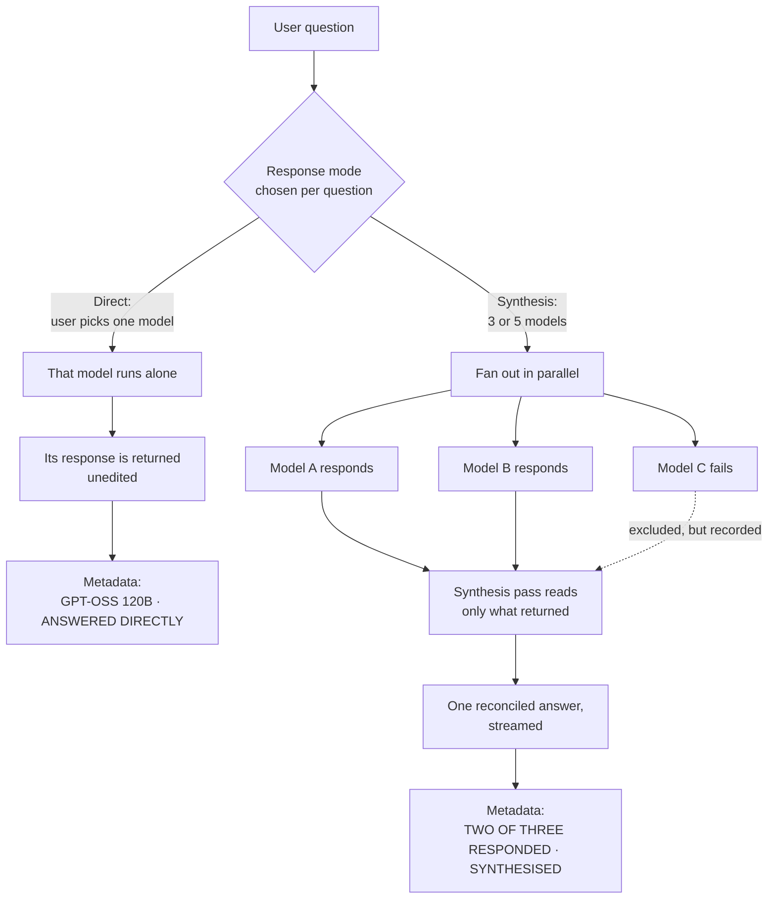
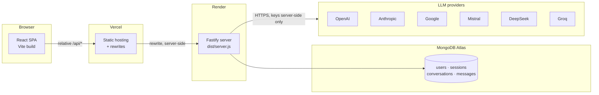
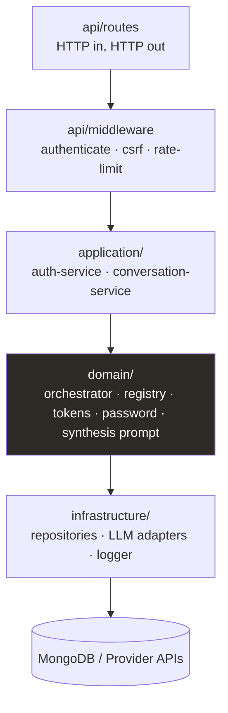
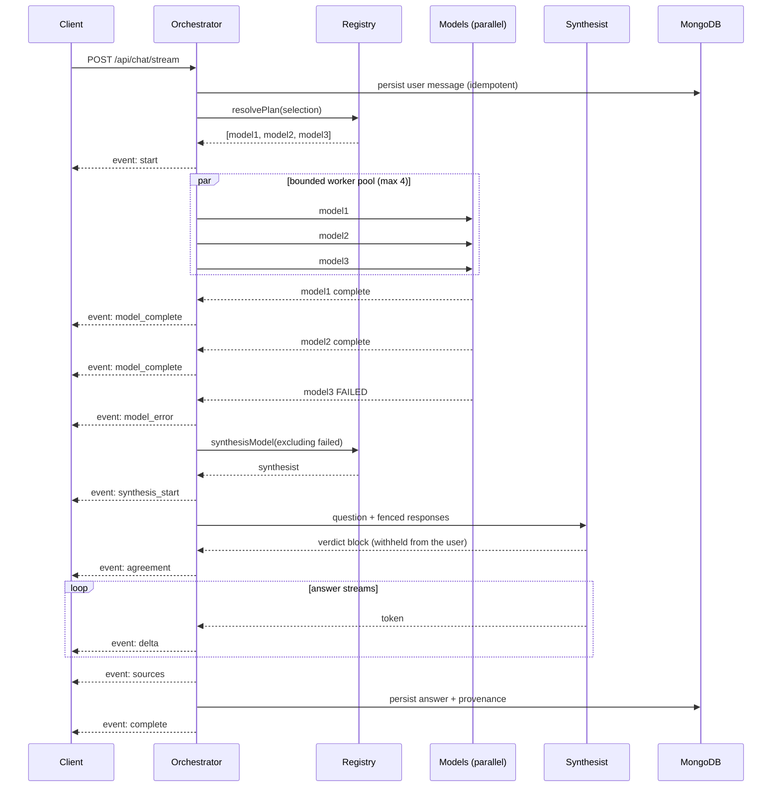
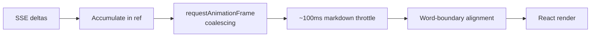
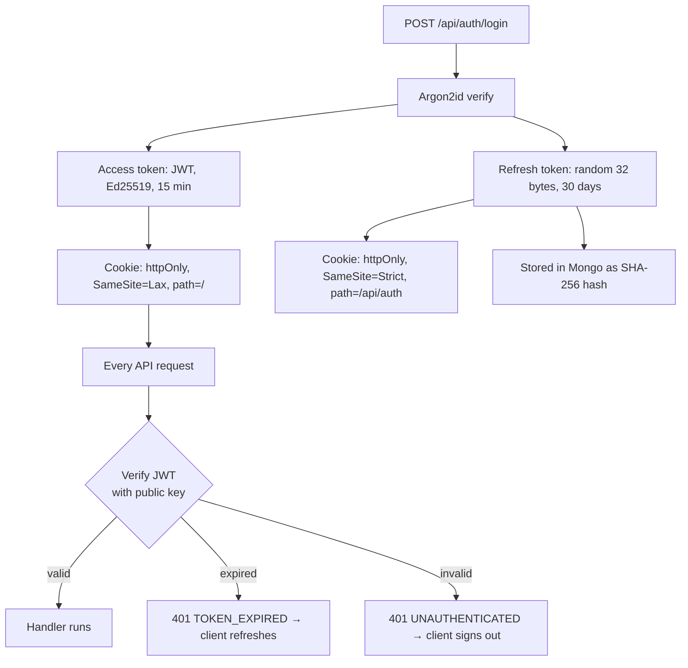
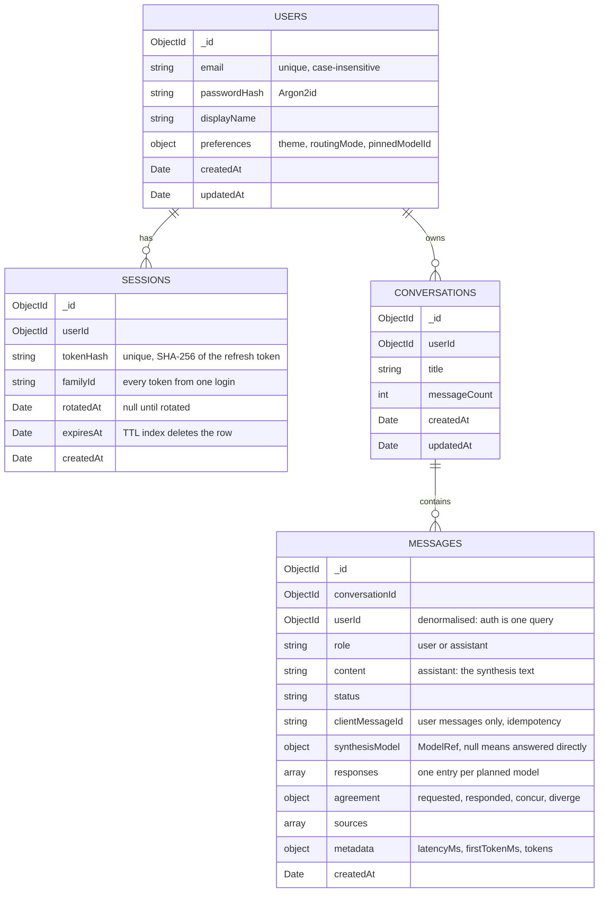
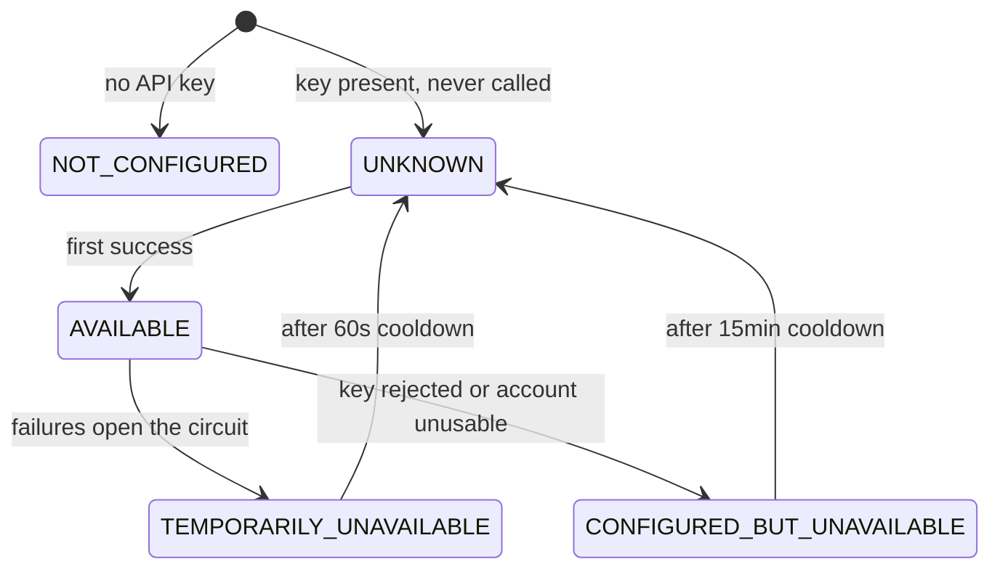
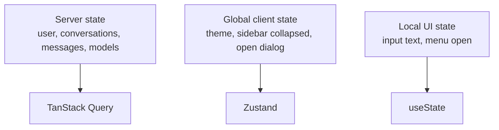
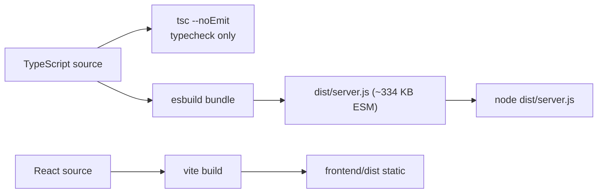

# NexusAI — Complete Project Guide

> A single document explaining what NexusAI is, how it is built, and why each
> decision was made. Written to be read start-to-finish before an interview.
>
> Everything here was read off the codebase, not from memory. Where a number or
> a name appears, it is the one the code actually uses.

---

## Table of contents

1. [The one-paragraph pitch](#1-the-one-paragraph-pitch)
2. [The product concept — Direct vs Synthesis](#2-the-product-concept--direct-vs-synthesis)
3. [Technology stack](#3-technology-stack)
4. [Repository structure](#4-repository-structure)
5. [System architecture](#5-system-architecture)
6. [Backend layered architecture](#6-backend-layered-architecture)
7. [The orchestrator — the heart of the product](#7-the-orchestrator--the-heart-of-the-product)
8. [The streaming protocol (SSE)](#8-the-streaming-protocol-sse)
9. [Authentication and sessions](#9-authentication-and-sessions)
10. [Security model](#10-security-model)
11. [Data model](#11-data-model)
12. [Provider integration and health](#12-provider-integration-and-health)
13. [Frontend architecture](#13-frontend-architecture)
14. [Design system](#14-design-system)
15. [Testing strategy](#15-testing-strategy)
16. [Build and deployment](#16-build-and-deployment)
17. [Architecture Decision Records](#17-architecture-decision-records)
18. [Interview questions you should be ready for](#18-interview-questions-you-should-be-ready-for)
19. [Known gaps — answer honestly](#19-known-gaps--answer-honestly)

---

## 1. The one-paragraph pitch

**NexusAI is a multi-model AI workspace.** You ask one question. You can either
pick a single model and get its answer directly, or send the question to several
models at once — they answer independently, and a *synthesis* model reconciles
their responses into one answer. Every answer carries **provenance**: which
models were asked, which actually responded, which disagreed, and whether the
answer was synthesised or came straight from one model.

The differentiator is not "we call several APIs". Anything can do that and show
you four columns — which hands the work back to the user. The differentiator is
**reconciliation plus provenance**: one answer you can read, and a record you can
check.

---

## 2. The product concept — Direct vs Synthesis

This is the single most important thing to be able to explain. Interviewers will
ask "what does your project actually do?" — answer with this.



**Key detail most people miss:** a manual model choice produces a *one-model
plan*, and a one-model plan never reaches the synthesis branch. This is enforced
in `resolvePlan()`:

```ts
if (request.selection.mode === 'manual') {
  const model = registry.find(request.selection.modelId);
  // ... availability checks ...
  // A manual choice is authoritative. No substitution, ever — a silent
  // swap would make the provenance rail report a model that never ran.
  return [model];
}
```

Then downstream: `contributions.length >= 2` is false, so no synthesist is
selected, and the orchestrator calls `answerDirectly()`, persisting
`synthesisModel: null`. That `null` is the server's permanent record that no
synthesis happened.

### Routing modes

| Mode | Models | Enum value |
|---|---|---|
| Single model | 1 | `single` |
| Synthesis · 3 models | 3 | `balanced` |
| Synthesis · 5 models | 5 | `thorough` |

Defined once: `const FANOUT: Record<RoutingMode, number> = { single: 1, balanced: 3, thorough: 5 }`

---

## 3. Technology stack

### Monorepo

| Thing | Choice | Why |
|---|---|---|
| Package manager | **pnpm 9.12** workspaces | Strict node_modules, no phantom dependencies |
| Runtime | **Node ≥ 22** | Native TypeScript stripping, `--env-file`, native `fetch` |
| Language | **TypeScript 5.7**, strict | Including `exactOptionalPropertyTypes` |
| Linting | **ESLint 9** flat config | Plus `jsx-a11y` and `react-hooks` |
| Testing | **Vitest 3** | One runner for both packages |

### Backend

| Layer | Choice | Why this and not the obvious alternative |
|---|---|---|
| HTTP | **Fastify 5** | Faster than Express, schema-first, first-class async |
| Database | **MongoDB 6 driver** | Document shape fits conversations/messages naturally |
| Password hashing | **`@node-rs/argon2`** (Argon2id) | Rust binding; OWASP-recommended over bcrypt |
| JWT | **`jose`** with **Ed25519 / EdDSA** | Asymmetric, small signatures, modern |
| Validation | **Zod 3** | Same schemas shared with the frontend |
| Logging | **Pino 9** | Structured JSON, with a redaction list |
| Build | **esbuild** | Bundles to one `dist/server.js` |

### Frontend

| Layer | Choice | Why |
|---|---|---|
| UI | **React 19** | |
| Build | **Vite 6** | |
| Styling | **Tailwind v4** | CSS-first config, `(--token)` custom-property syntax |
| Server state | **TanStack Query v5** | Caching, invalidation, background refetch |
| Client state | **Zustand 5** | Theme and UI store only — deliberately small |
| Routing | **React Router v7** | |
| Markdown | **react-markdown + remark-gfm** | Lazy-loaded chunk |
| Icons | **lucide-react** | |

### Shared

`@nexusai/contracts` — a workspace package of **Zod schemas** imported by *both*
sides. The API request/response shape, the SSE event union, and the error codes
have exactly one definition. This is the answer to "how do you keep frontend and
backend in sync?"

---

## 4. Repository structure

```
NexusAI/
├── backend/              @nexusai/backend
│   ├── src/
│   │   ├── api/          HTTP layer — routes, middleware, error mapping
│   │   ├── application/  Use-case services (auth, conversations)
│   │   ├── domain/       Business logic — no framework, no I/O
│   │   ├── infrastructure/  Mongo, LLM adapters, logging
│   │   ├── config/       Env parsing and validation (Zod)
│   │   └── server/       Composition root — main.ts, app.ts, container.ts
│   ├── tests/            unit / api / security / manual
│   └── scripts/          build.mjs, generate-keys.mjs
├── frontend/             @nexusai/frontend
│   └── src/
│       ├── app/          Router, providers, auth guard
│       ├── components/   layout / marketing / ui
│       ├── features/     auth, chat, conversations, models, search, settings
│       ├── pages/        home, auth, app
│       ├── stores/       Zustand (theme, ui)
│       ├── lib/          routes, http, formatters
│       └── styles/       tokens.css, base.css, markdown.css
├── packages/contracts/   @nexusai/contracts — shared Zod schemas
└── docs/                 architecture, backend, design, product, decisions (ADRs)
```

**Why `features/` and not `components/` for everything?** A feature folder owns
its API calls, hooks, and components together. You can delete a feature by
deleting a folder. `components/ui` holds only things with no business meaning
(Button, IconButton, Skeleton).

---

## 5. System architecture



**The critical detail: the browser only ever calls a relative `/api/*` path.**
Vercel rewrites that to the Render backend server-side. This keeps everything
same-origin from the browser's point of view, which is what allows the refresh
cookie to be `SameSite=Strict`. The rewrite is *load-bearing*, not a convenience.

`vercel.json` rewrite order is a contract:

```json
{ "rewrites": [
  { "source": "/api/:path*", "destination": "https://<backend>/api/:path*" },
  { "source": "/(.*)",       "destination": "/index.html" }
]}
```

Reversed, every API call would be answered with the HTML shell — which looks
exactly like a total backend outage. There is a test that asserts the ordering.

---

## 6. Backend layered architecture



**The rule: dependencies point inward.** `domain/` imports nothing from
`infrastructure/` or `api/`. It receives what it needs through interfaces
(`deps.registry`, `deps.messages`). This is why the orchestrator can be tested
with a fake adapter and an in-memory repository — no database, no network.

The composition root is `server/container.ts`; it constructs the concrete
implementations and injects them. `main.ts` is the only place that knows the
real wiring:

```
loadConfig() → connect(mongo) → ensureIndexes() → buildContainer() → buildApp() → listen()
```

Boot fails loudly if configuration is wrong. There is no development fallback
that generates an ephemeral key — "that pattern reliably escapes into production."

---

## 7. The orchestrator — the heart of the product

File: `backend/src/domain/orchestration/orchestrator.ts`



**Why `agreement` arrives before the text.** The synthesiser is instructed to
open with a verdict block classifying each model as concurring or diverging.
That block is machine notation, so the orchestrator withholds everything until
it has been parsed — then emits `agreement`, then streams the answer. If the
synthesiser ignores the format, stances stay `unknown` and the text is still the
answer; nothing is guessed.

### Four things to call out

**1. Bounded concurrency, not `Promise.all`.**

```ts
const workers = Math.min(config.MAX_CONCURRENT_MODEL_CALLS, plan.length);
// Bounded concurrency: N workers draining a shared queue. An unbounded
// Promise.all over a user-controlled list is a fan-out amplifier.
```

Default `MAX_CONCURRENT_MODEL_CALLS = 4`. One user request must not become an
unbounded burst of provider calls.

**2. Failed models are excluded from synthesis but kept in provenance.**

```ts
const failedThisTurn = [...attempts.values()]
  .filter((a) => a.outcome !== 'complete')
  .map((a) => a.model.id);
const ineligible = [...failedThisTurn];
let synthesist = contributions.length >= 2 ? registry.synthesisModel(ineligible) : undefined;
if (!synthesist) { yield* this.answerDirectly(...); return; }
```

A model that failed cannot be chosen to *write* the synthesis — but it keeps its
place in the rail, and the count says "two of three responded". Dropping it would
make a degraded turn look like a perfect one.

**3. Graceful degradation has three levels.**

| Situation | Behaviour |
|---|---|
| All models respond | Synthesis reconciles them |
| Some fail | Synthesis over survivors; failures recorded |
| Only one survives | Direct answer from that survivor, `synthesisModel: null` |
| No usable response | Honest error — `modelUnavailable` if one was asked, `providerUnavailable` otherwise |

**4. Failover has a hard boundary.** If the synthesis model fails *before any
text has streamed*, the orchestrator moves to the next eligible model. Once text
has reached the reader it deliberately does **not** switch — rewriting an answer
someone is already reading is worse than the failure.

### Timeouts

| Setting | Default |
|---|---|
| `MODEL_TIMEOUT_MS` | 60 s |
| `SYNTHESIS_TIMEOUT_MS` | 90 s |
| `ORCHESTRATION_TIMEOUT_MS` | 150 s |
| `MAX_HISTORY_MESSAGES` | 20 |
| `MAX_HISTORY_CHARS` | 24,000 |
| `MAX_CONCURRENT_STREAMS_PER_USER` | 3 |

---

## 8. The streaming protocol (SSE)

**Server-Sent Events, not WebSockets.** The data flows one way — server to
client — so a bidirectional socket would be extra failure modes for nothing. SSE
also reconnects on its own and works over plain HTTP/2.

The event union is a Zod discriminated union in `packages/contracts/src/chat.ts`,
so both sides parse the same shape:

```
start
  → model_start                      (×N, the plan, in fixed order)
  → model_complete / model_error     (×N, as they land)
  → synthesis_start                  (synthesis turns only)
  → agreement                        (before any text — see §7)
  → delta                            (×many)
  → sources                          (always empty today — ADR-018)
  → complete
```

Plus `error` and `cancelled` as terminal alternatives.

**A direct or degraded turn** has no `synthesis_start`. It emits `agreement`
and then the chosen (or surviving) model's whole response as a single `delta`
— verified against a live run:

```
direct:    start → model_start → model_complete → agreement → delta → sources → complete
```

**Only the synthesis streams.** Individual models report once, whole. This is
deliberate: their responses exist to be *compared*, not watched. Streaming six
models simultaneously would be unreadable.

### Frontend rendering pipeline



Three separate problems, three separate fixes:

- **rAF coalescing** — many deltas per frame become one render.
- **Markdown throttle** — re-parsing markdown on every token is the expensive part.
- **Word alignment** — `toWordBoundary()` trims a partial trailing word so text
  doesn't visibly reflow mid-word. **This is not fake typing.** Nothing is
  delayed artificially; completed words are simply released a little behind the
  raw stream.

The invariant: **`render(streamed) === render(complete)`**. What you see while
streaming must equal what you see after reload. There is a test for it.

Two bugs worth knowing (both real, both fixed):

- **Hidden tab.** `requestAnimationFrame` never fires in a background tab, so a
  stream that finished while hidden left no text. Fixed with an explicit flush in
  a `finally` block.
- **Duplicate answers.** A pending turn and the persisted turn both rendered.
  Root cause was *ownership*, not rendering — fixed by reconciling on message id:
  ```ts
  const settled = state.messageId !== null && (history?.some((m) => m.id === state.messageId) ?? false);
  const showPendingTurn = pending !== null && !settled;
  ```

---

## 9. Authentication and sessions



### Two token types, on purpose

| | Access token | Refresh token |
|---|---|---|
| Format | Signed JWT (EdDSA) | Opaque random bytes |
| Lifetime | 15 min | 30 days |
| Storage | Nowhere server-side | SHA-256 hash in `sessions` |
| Revocable? | **No** | **Yes** |

The reasoning: an access token must be verifiable on *every* request without a
database read, so it is stateless. A refresh token must be **revocable**, which a
stateless token fundamentally is not. Using the right mechanism for each job
avoids the classic mistake of a long-lived stateless token you cannot invalidate.

> **Consequence to know:** rotating the JWT signing key invalidates access tokens
> but **does not sign users out** — their refresh cookie still works. Terminating
> sessions requires clearing the `sessions` collection.

### Refresh rotation with reuse detection

Every refresh issues a new token and marks the old one rotated.

- Presenting an **already-rotated** token → **reuse detected** → the whole
  session *family* is revoked.
- Except inside a **60-second grace window** — because a real browser with two
  tabs can legitimately fire two refreshes at once, and without the grace period
  normal use would trip the detector.

### Password hashing

```ts
const PARAMS = { memoryCost: 19_456, timeCost: 2, parallelism: 1 };  // OWASP Argon2id baseline
```

**Timing-attack defence:** when the email is unknown, the code still verifies
against a real dummy hash. Without it, "no such user" returns in microseconds and
"wrong password" takes ~50 ms — a usable account-enumeration oracle.

---

## 10. Security model

| Threat | Defence |
|---|---|
| XSS stealing tokens | `httpOnly` cookies — no token is readable by JavaScript |
| CSRF | `SameSite` + exact `Origin` match + required custom header `x-nexus-client` |
| Credential stuffing | Rate limit: **5 attempts / 15 min** on auth writes |
| Account enumeration | Dummy Argon2 verify on unknown email |
| Session hijack | httpOnly + Secure + rotation + reuse detection kills the family |
| Open redirect | `safeNext()` narrows `?next=` to a single leading slash + path |
| Prompt injection | Per-turn random fence labels (below) |
| Secret leakage in logs | Pino redaction list |

### Rate limits

| Scope | Limit |
|---|---|
| `authWrite` | 5 / 15 min |
| `refresh` | 30 / 15 min |
| `chat` | 20 / min |
| `read` | 120 / min |

In-process (no Redis — ADR-013), so the effective limit multiplies by instance
count. **Documented rather than hidden** — that honesty is the point.

### CSRF, precisely

```ts
const MUTATING = new Set(['POST', 'PATCH', 'PUT', 'DELETE']);
if (request.headers['x-nexus-client'] !== 'web') throw Errors.unauthenticated();
const origin = request.headers.origin ?? deriveOrigin(request.headers.referer);
if (!origin || origin !== webOrigin) throw Errors.unauthenticated();
```

A cross-origin form or image *cannot* set a custom header; attempting it forces a
CORS preflight that is denied. A mutating request with **no** Origin is rejected
rather than trusted.

### Prompt injection — the trust boundary (ADR-017)

Model output arrives from other vendors' systems and is then placed next to the
synthesis instructions. That makes it **untrusted input**.

```
<<<BEGIN response-model-a 7f3c9a12b4de>>>
...model output, byte for byte...
<<<END 7f3c9a12b4de>>>
```

- The label is **random per turn** (`randomBytes(6)`), and regenerated if it
  happens to appear in the content — so a response cannot close its own fence.
- **The user's question is fenced too.** The person asking is also an untrusted
  party here: without it, a prompt could forge a response block for a model that
  never ran.
- Content passes through **unmodified**. An attempt to hijack the synthesis is
  *evidence about that model's output*, not something to censor.
- **Counts come from the backend**, never from anything the synthesiser was
  persuaded to say.

---

## 11. Data model



### What one entry in `responses` holds

Every model in the plan gets an entry — **including the ones that failed**. The
array is in plan order, because position is what identifies a model on the
provenance rail.

| Field | Type | Meaning |
|---|---|---|
| `model` | `ModelRef` | `{ modelId, provider, displayName }` |
| `text` | string | That model's full response (empty if it failed) |
| `outcome` | enum | `complete` · `failed` · `empty` · `cancelled` |
| `stance` | enum | `concurs` · `diverges` · `unknown` — failed models are always `unknown` |
| `latencyMs` | int | |
| `inputTokens` / `outputTokens` | int or null | null when the provider does not report them |
| `errorCode` | string or null | Why it failed, e.g. `MODEL_NOT_FOUND` |

> **Naming trap worth knowing:** the frontend calls these `slots`. That is only its
> view-model name — `answer-view.ts` does `message.responses.map(toSlot)`. The
> persisted and wire field is `responses`.

### Indexes that matter

| Collection | Index | Purpose |
|---|---|---|
| `users` | `{ email: 1 }` unique, case-insensitive collation | One account per address |
| `sessions` | `{ tokenHash: 1 }` unique | Lookup + no duplicates |
| `sessions` | `{ expiresAt: 1 }` TTL `expireAfterSeconds: 0` | **Mongo deletes expired sessions itself** |
| `conversations` | `{ userId: 1, updatedAt: -1 }` | Sidebar list query |
| `messages` | `{ conversationId: 1, createdAt: -1, _id: -1 }` | Stable pagination — `_id` breaks same-millisecond ties |
| `messages` | `{ userId: 1, clientMessageId: 1 }` unique | **Idempotency** — a retried send cannot double-post |

---

## 12. Provider integration and health

### Adapter pattern

```
infrastructure/llm/
├── adapter.ts              the interface every provider satisfies
├── adapters/
│   ├── openai-compatible.ts   OpenAI, Groq, DeepSeek, Mistral (same wire format)
│   ├── anthropic.ts           different request/response shape
│   ├── google.ts              different again
│   └── test-adapter.ts        deterministic, for tests
├── errors.ts               maps provider HTTP codes to domain errors
└── sse-parse.ts            shared SSE line parser
```

Four providers share `openai-compatible` because they speak the same wire
format — you only write a new adapter when the shape genuinely differs.

### Health state machine



A provider starts `UNKNOWN` — configured but unverified, **the honest state
before anything has been asked of it**. It only becomes `AVAILABLE` after a real
success. The UI never claims availability it has not observed.

### A real bug worth telling

A bare HTTP **403** was being classified as an auth error, which put the whole
provider into a 15-minute cooldown — even when 403 actually meant "your plan
doesn't include this model". The fix narrowed the match:

```ts
const PLAN_RESTRICTED =
  /tier[_ ]not[_ ]allowed|model[_ ]not[_ ]allowed|not allowed to use|plan does not (include|allow)|not (subscribed|entitled) to/;

if (status === 401) return Errors.providerAuthError(ctx);
if (status === 403) {
  return PLAN_RESTRICTED.test(lower) ? Errors.modelNotFound(ctx) : Errors.providerAuthError(ctx);
}
```

One model being unavailable should not poison five others.

### A second one, found while verifying this guide

DeepSeek answers **402 "Insufficient Balance"** with a key that works. Treating
that like a rejected key is right — an operator must act, and the 15-minute
re-check means topping the account up recovers it without a restart. But the
reason shown in the model selector said *"The configured credentials were
rejected"*, which is false for that case and sends the reader hunting for a key
problem that doesn't exist.

The fix records the **cause**, not just the time. The classifier tags a
402/account-unusable failure `authCause: 'account'`; the health tracker stores
it per provider; the reason reports *"The provider account cannot serve
requests"* for that case and keeps the exact credential wording for a real 401.
An integration test drives a real 402 through the classifier, orchestrator,
tracker and registry and asserts what the client receives.

### Model catalog

| Model | Provider | Context | Synthesis-capable |
|---|---|---|---|
| GPT-4o | OpenAI | 128K | ✓ |
| Claude Sonnet 4.5 | Anthropic | 200K | ✓ |
| Gemini 2.5 Flash | Google | 1.05M | ✓ |
| Mistral Large | Mistral | 128K | ✓ |
| DeepSeek V4 Flash | DeepSeek | 64K | ✗ |
| GPT-OSS 120B | Groq | 128K | ✗ |

---

## 13. Frontend architecture

### State: three kinds, three tools



**The session is server state, not client state.** Keeping a parallel copy in a
store creates two sources of truth about who you are — which is how a UI ends up
showing a signed-in shell to a signed-out user.

### Route map

| Path | Access | Notes |
|---|---|---|
| `/` | public | The single marketing page; redirects to `/app` if signed in |
| `/login`, `/register` | public | Honour `?next=` |
| `/app` | private | Workspace root **is** a new conversation |
| `/app/chat/:id` | private | Same component, history loads |
| `*` | any | Not found |

`/app` creates nothing. A conversation exists only once a message is sent; the
URL is then **replaced** (not pushed) so Back doesn't return to a stale empty
workspace, and no graveyard of empty conversations accumulates.

Search (`⌘K`) and Settings (`⌘,`) are **dialogs, not routes** — they are
transient overlays and must not unmount the conversation behind them (ADR-010).

### The provenance rail

A 2px vertical rail in the left gutter of each answer, one segment per model:

| Visual | Meaning |
|---|---|
| Solid segment | Model responded |
| Break/notch | Model diverged from the synthesis |
| Hollow segment | Model never answered |
| Position | *Identifies* the model (not colour) |

Model identity is **never** encoded as vendor colour — position and a neutral
density ramp carry it instead.

---

## 14. Design system

Two token layers, no third: **primitives** → **semantic tokens**. Components use
only semantic tokens. Single source of truth is `styles/tokens.css`; there is a
test that fails if a component hardcodes a colour.

The design language keeps an explicit **"AI-generated UI" checklist** — anything
matching is removed on sight:

> gradient · glow · glassmorphism · backdrop blur · rounded card as default
> container · shadow on a non-floating element · radius above 8px · decorative
> badge · icon as ornament · emoji · animated background · vendor-coloured model
> chips · metric cards · centred marketing layout · type above 25px

And a **removal test**: *strip every shadow, transition and rounded corner — is it
still premium?* Yes, because what remains carries the design: two typefaces in
two registers, a warm graphite field, four line weights, an 8-step rhythm, a
controlled measure, and the segmented rail.

**Theme.** One `data-theme` attribute on `<html>` plus `localStorage`, resolved by
an inline script **before first paint** so there is no flash. Precedence:
*a theme chosen on this device → account preference → system*.

---

## 15. Testing strategy

```
backend/tests/
├── unit/       domain logic with fakes
├── api/        full HTTP round trips (Fastify inject)
├── security/   CSRF, prompt injection, proxy trust
└── manual/     live provider checks, skipped unless keys present
```

Current state: **backend 252 passing / 13 skipped**, **frontend 338 passing**.
The 13 skips are all `provider-live` tests, gated on real API keys.

Notable test types:

- **Accessibility** — 14 axe-core tests across home, auth, composer, empty state,
  model selector, answer surface, settings, password form, header.
- **Deployment config** — models Vercel's top-down rewrite matching so the test
  fails for the reason production would fail.
- **Design tokens** — parses the CSS to assert no component hardcodes a colour.
- **Link integrity** — every in-page anchor must resolve to a section that exists
  (this caught four dead footer links that had survived two refactors).

`pnpm verify` = `typecheck && lint && test && build`.

> **A lesson worth repeating in an interview:** `vitest` does *not* typecheck.
> A targeted test run can pass while `tsc` fails. Always run the full verify.

---

## 16. Build and deployment



The backend ships as **one bundled file** rather than running TypeScript directly
in production — `--experimental-transform-types` is a development convenience and
experimental flags do not belong in production (ADR-015). Runtime dependencies
stay external, so the deployment also needs production `node_modules`.

### Required production environment

| Variable | Notes |
|---|---|
| `MONGODB_URI`, `MONGODB_DB_NAME` | |
| `JWT_PRIVATE_KEY`, `JWT_PUBLIC_KEY` | Ed25519 PEM, generated **for that environment** (`pnpm backend:keys`) |
| `WEB_ORIGIN` | Exact origin — CSRF depends on it |
| At least one provider key | A production server with none **refuses to start** |

---

## 17. Architecture Decision Records

ADRs live in `docs/decisions/`. Each records context, decision, alternatives
considered, and consequences.

| ADR | Decision |
|---|---|
| 009 | Repository structure: frontend / backend / packages |
| 010 | A public product surface, and an `/app` prefix |
| 011 | Custom properties in Tailwind v4 utilities |
| 012 | Comparison stays inline; no side panel |
| 013 | Backend stack, and **dropping Redis** for v1 |
| 014 | Synthesis strategy, and how stance is measured |
| 015 | Production build: esbuild bundle, no experimental runtime |
| 016 | Provider health signals, verification without credentials |
| 017 | **Model output is untrusted input to the synthesis stage** |
| 018 | Sources remain planned, and the empty event stays |
| 019 | Frontend and backend deploy behind one origin |
| 020 | One public page |

**Why ADRs matter in an interview:** they show you can justify a decision *and*
name what you gave up. ADR-013 dropping Redis is a good one to discuss — it means
rate limits are per-instance, which is a real tradeoff the doc states openly
rather than hiding.

---

## 18. Interview questions you should be ready for

**"Walk me through your project."**
> NexusAI is a multi-model AI workspace. You ask one question and either pick a
> model for a direct answer, or send it to several and get their responses
> reconciled into one. Every answer records which models took part. It's a pnpm
> monorepo — Fastify/MongoDB backend, React/Vite frontend, and a shared Zod
> contracts package so both sides parse the same schemas.

**"What was the hardest part?"**
> The orchestrator's failure handling. It's easy to fan out to five models; the
> hard part is what happens when two fail. Failed models must be excluded from
> the synthesis input but still appear in the provenance, the synthesis writer
> must be chosen from models that actually succeeded, and if only one survives
> you fall back to a direct answer and record that no synthesis happened. Each of
> those is a place where it would be easy to quietly show a nicer-looking result
> than what really occurred.

**"Why SSE and not WebSockets?"**
> Data only flows one way. SSE reconnects on its own, works over plain HTTP, and
> has fewer failure modes. A bidirectional socket would be extra complexity for
> no benefit.

**"How do you keep frontend and backend in sync?"**
> A shared workspace package of Zod schemas. The API shapes, the SSE event union,
> and the error codes have exactly one definition, imported by both.

**"How do you handle authentication?"**
> Two tokens. A short-lived stateless JWT for access so every request can be
> verified without a database read, and an opaque, database-stored refresh token
> because revocation matters and a stateless token can't be revoked. Both in
> httpOnly cookies. Refresh rotates with reuse detection and a 60-second grace
> window for concurrent tabs.

**"Where are the API keys?"**
> Backend only. Never in a `VITE_` variable, an API response, browser storage, a
> log, or the frontend bundle. The frontend asks `/api/models` what's available;
> it never sees a credential.

**"How do you prevent prompt injection?"**
> Model output is untrusted input. Each response is wrapped in a fence carrying a
> per-turn random label, so no response can close its own section and issue
> instructions. The user's question is fenced too. Content passes through
> unmodified — a hijack attempt is evidence about that model, not something to
> censor. And all counts come from the backend, never from the model's text.

**"What would you do differently?"**
> Implement the `kid`-based key rotation the security doc describes. Right now
> the verifier takes a single public key, so rotating is a hard cutover. A key set
> would make it zero-downtime.

**"Tell me about a bug you fixed."**
> Pick one — duplicate answers (ownership, not rendering), the hidden-tab stream
> (rAF never fires in a background tab), or the 403 misclassification (one model's
> plan restriction was poisoning an entire provider for 15 minutes). All three
> are good because the obvious fix was wrong and the real fix was one layer down.

---

## 19. Known gaps — answer honestly

Interviewers respect a candidate who knows their project's limits. Do not
oversell.

| Gap | Honest framing |
|---|---|
| **JWT key was committed to public git history** | It was in a `.env.backup-*` file that matched neither `.gitignore` pattern. Rotated locally; production rotation is a separate step. Good story about *why* `.env.*` is now ignored wholesale. |
| Rate limiting is in-process | No Redis (ADR-013), so limits multiply by instance count. Documented, not hidden. |
| Key rotation is a hard cutover | The docs describe a `kid` key set; the code verifies against one key. |
| `sources` events are always empty | ADR-018 — the event exists in the contract but RAG is not built. It is deliberately *not* faked. |
| Some providers unverified | Mistral and DeepSeek are blocked by account state; OpenAI and Anthropic were never configured. The UI reports `UNKNOWN` rather than claiming availability. |
| Not publicly deployed | The homepage says "Pre-launch · Not publicly deployed" rather than implying traffic it doesn't have. |

**The principle running through the whole project:** never fake. Not model
responses, not latency, not availability, not provenance, not test results. When
something can't be verified, it says `NOT VERIFIED` instead of `PASS`.

---

*Generated from the codebase. To regenerate the facts: `pnpm verify`, then read
`docs/decisions/` for the reasoning behind each choice.*
